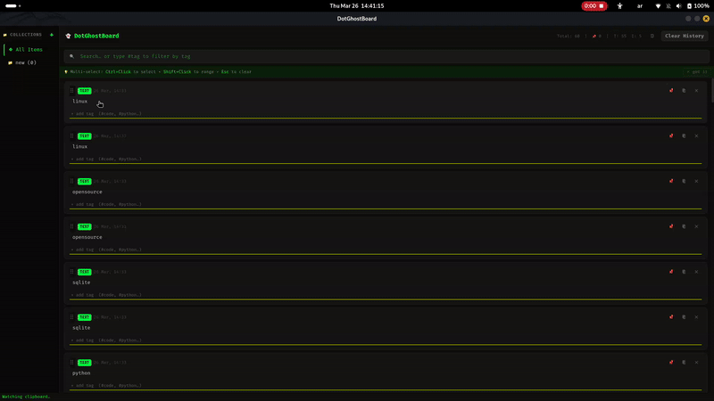

# 👻 DotGhostBoard

> Advanced clipboard manager for Kali Linux — part of the **DotSuite** toolkit.


---

## What is DotGhostBoard?

DotGhostBoard is a lightweight, privacy-first clipboard manager built natively for Linux. It runs silently in the background, capturing everything you copy — text, images, and video paths — and stores them locally in a SQLite database. No cloud. No telemetry. No Electron.

Think **Ditto** (Windows) or **CopyQ** (Linux) — but built for the DotSuite ecosystem with a Kali-native dark aesthetic.


---

## Features

- **Text capture** — Every text you copy is saved instantly
- **Image capture** — Screenshots and copied images saved as `.png`
- **Video path detection** — Detects copied file paths for `.mp4`, `.mkv`, `.avi`, and more
- **Pin system** — Pin important items; they are protected from deletion forever
- **Persistent storage** — SQLite database survives reboots
- **Real-time search** — Filter your clipboard history instantly
- **Clear history** — Wipe unpinned items in one click (pinned items always stay)
- **System tray** — Lives quietly in your tray, always available
- **IPC shortcut** — `Ctrl+Alt+V` shows the window from anywhere via local socket
- **App icon** — Auto-generated neon ghost icon via `scripts/generate_icon.py`
- **Dark Neon UI** — Custom QSS theme built for dark desktops
- **Settings panel** — ⚙ Max history limit, privacy clear-on-exit, theme toggle
- **Keyboard navigation** — `↑`/`↓` to move between cards, `Enter` to copy, `Esc` to clear focus
- **Double-click to paste** — Double-click any card to copy it instantly
- **Standalone autostart** — `scripts/setup_autostart.py` sets up boot entry without bash
- **Image thumbnail previews** — Lazy-loaded thumbnails capped at 300×180px; deferred rendering via `QTimer.singleShot`
- **Video thumbnails via ffmpeg** — First-frame extraction from video files; background thread processing; graceful fallback if ffmpeg unavailable
- **Auto-cleanup** — Configurable `max_captures` limit (default 100); oldest unpinned captures deleted from disk on startup
- **Image viewer popup** — Full-size image preview with smooth scaling; `Ctrl+C` to copy image; `Escape` to close
- **Copy image to clipboard** — Image items now copy actual image data (not file path) back to clipboard
- **Drag & drop reorder** — Pinned cards show drag handle; reorder persists via `sort_order` in database
- **Tag system** — Assign custom `#tags` to any item; colored chip display with rotating 6-palette colors; inline autocomplete from existing tags


- **Combined search** — Search by text and tag simultaneously (e.g. `"python #code"`); tag-only filter works on all item types
- **Collections** — Group items into named folders; sidebar panel with click-to-filter, right-click to rename/delete, drag card to organize



- **Multi-select** — `Ctrl+Click` to toggle, `Shift+Click` for range selection; neon green `✓` overlay on selected cards


- **Bulk actions toolbar** — Appears when 2+ selected: Pin All, Unpin All, Add Tag, Export, Delete All, Cancel
- **Export** — Export selected items to `.txt` (timestamped blocks) or `.json` (structured data with tags)
- **Global tag manager** — ⚙ Settings → "Manage Tags…"; rename or delete tags across all items in one click
- **Drag & drop visual feedback** — Ghost pixmap with neon border while dragging; source card dims to 35%; drop targets highlight with dashed green border

**Native Desktop Integration:**
DotGhostBoard integrates seamlessly with  desktop environment dock and app launcher.


---

## Project Structure

```
DotGhostBoard/
├── main.py                      # Entry point + IPC local server
├── ghost.db                     # SQLite database (auto-created)
├── core/
│   ├── watcher.py               # Clipboard monitor (QTimer-based)
│   ├── storage.py               # Database CRUD layer
│   └── media.py                 # Image/video handler
├── ui/
│   ├── dashboard.py             # Main window + keyboard nav + settings wiring
│   ├── widgets.py               # Item card widget (double-click, focus)
│   ├── settings.py              # Settings dialog (v1.1.0)
│   └── ghost.qss                # Dark neon stylesheet
├── data/
│   ├── icons/                   # Generated app icons + ghost.svg source
│   ├── captures/                # Saved images (.png)
│   ├── pins/                    # Backup copies of pinned images
│   ├── v_logs/                  # Video path log file
│   └── settings.json            # User settings (v1.1.0)
├── scripts/
│   ├── generate_icon.py         # Draws ghost icon at 16/32/48/64/128/256px
│   ├── install.sh               # Autostart + shortcut + .desktop installer
│   └── setup_autostart.py       # Standalone Python autostart installer (v1.1.0)
├── tests/
│   ├── test_storage.py          # 32 tests — full CRUD coverage
│   └── test_media.py            # 27 tests — media detection & file ops
├── todo_list(v1.0.0).json
├── todo_list(v1.1.0).json
├── roadmap(v1.x).json
├── pytest.ini
├── requirements.txt
└── .gitignore
```

---

## Requirements

| Dependency | Version  |
|------------|----------|
| Python     | 3.11+    |
| PyQt6      | 6.6.0+   |
| Pillow     | 10.0.0+  |
| pytest     | 7.0.0+   |

---

## 📥 Download

**Download for your platform:**

- 🐧 [AppImage (Linux)](https://github.com/kareem2099/DotGhostBoard/releases/latest)
- 📦 [DEB (Ubuntu/Debian)](https://github.com/kareem2099/DotGhostBoard/releases/latest)
- 🪟 [EXE (Windows)](https://github.com/kareem2099/DotGhostBoard/releases/latest)
- 🍎 [DMG (macOS)](https://github.com/kareem2099/DotGhostBoard/releases/latest)

---

## Installation

### Option A — System Python (Kali Linux)

PyQt6 and Pillow are usually pre-installed on Kali:

```bash
git clone https://github.com/kareem2099/DotGhostBoard.git
cd DotGhostBoard
python3 main.py
```

### Option B — Virtual Environment (Recommended)

```bash
git clone https://github.com/kareem2099/DotGhostBoard.git
cd DotGhostBoard

# Create isolated environment
python3 -m venv venv --system-site-packages
source venv/bin/activate

# Install dependencies
pip install -r requirements.txt

# Generate app icon (run once)
python3 scripts/generate_icon.py

# Run
python3 main.py
```

### Option C — pip install (PyPI)

```bash
pip install dotghostboard
dotghostboard
```

### Option D — AppImage (Portable)

Download the `.AppImage` from [Releases](https://github.com/kareem2099/DotGhostBoard/releases), then:

```bash
chmod +x DotGhostBoard-*.AppImage
./DotGhostBoard-*.AppImage
```

No installation needed — runs on ANY Linux distro.

### Option E — Full install (autostart + shortcut + icon)

```bash
chmod +x scripts/install.sh
./scripts/install.sh
```

This sets up autostart on login and registers the `Ctrl+Alt+V` shortcut via `xfconf-query`.

### Option F — Build AppImage from source

```bash
pip install pyinstaller
chmod +x scripts/build_appimage.sh
./scripts/build_appimage.sh
```

---

## Usage

| Action | How |
|--------|-----|
| Copy anything | Just use `Ctrl+C` anywhere — DotGhostBoard captures it automatically |
| Show window | Press `Ctrl+Alt+V` from anywhere |
| Pin an item | Click 📌 on any card |
| Unpin an item | Click 📍 on a pinned card |
| Copy back | Click ⎘ on any card — or **double-click** the card |
| Delete an item | Click ✕ — pinned items are protected |
| Search | Type in the search bar at the top |
| Keyboard navigation | Press `↑` / `↓` to move focus; `Enter` or `Space` to copy; `Esc` to clear |
| Clear history | Click "Clear History" — pinned items are never deleted |
| Settings | Click ⚙ in the top bar — adjust history limit, privacy options |
| Minimize | Click X — the app stays alive in the system tray |
| Quit | Right-click the tray icon → Quit |

---

## Running Tests

```bash
python3 -m pytest
```

Expected output:
```
tests/test_media.py ...........................                         [ 28%]
tests/test_settings.py ............                                     [ 41%]
tests/test_storage.py ................................                  [ 75%]
tests/test_storage_v120.py ..............                               [ 90%]
tests/test_thumbnailer.py .........                                     [100%]

94 passed in 0.40s
```


---

## Roadmap

| Version | Codename | Status | Goal |
|---------|----------|--------|------|
| v1.0.0 | Ghost | ✅ Released | Stable base — clipboard, pin system, dark UI, SQLite |
| v1.1.0 | Phantom | ✅ Released | Settings panel, keyboard nav, double-click paste, SVG icon |
| v1.2.0 | Specter | ✅ Released | Image thumbnails, video preview via ffmpeg, auto-cleanup, image viewer |
| v1.3.0 | Wraith | ✅ Released | Tags, collections, multi-select, bulk actions, export |
| v1.4.0 | Eclipse | 📋 Planned | AES-256 encryption, master lock, stealth mode |
| v1.5.0 | Nexus | 🔭 Future | Local network sync, CLI companion, plugin system |

Full details in [`roadmap(v1.x).json`](roadmap(v1.x).json)

---

## Contributing

Contributions are welcome. Please read [`CONTRIBUTING.md`](CONTRIBUTING.md) before submitting a pull request.

---

## License

MIT — see [`LICENSE`](LICENSE) for details.

---

## Part of DotSuite

DotGhostBoard is one tool in the **DotSuite** collection — a set of lightweight, privacy-focused productivity tools built for Linux power users.

> DotEnv · DotCommand · DotSense · DotFetch · DotShare · DotScramble · **DotGhostBoard**

---

*Built with 💀 on Kali Linux*