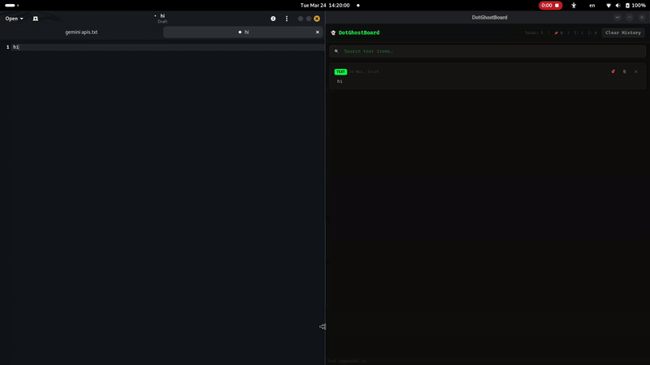
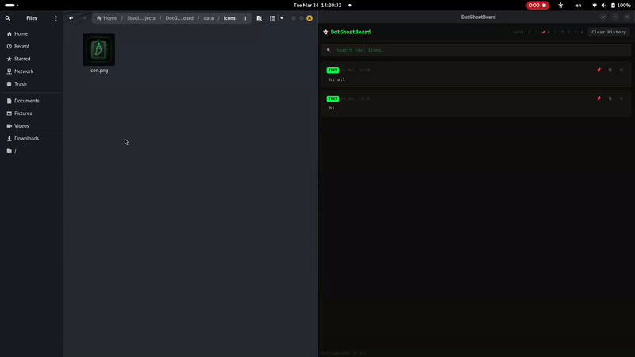
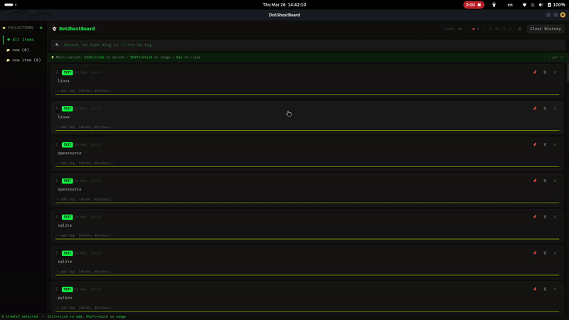
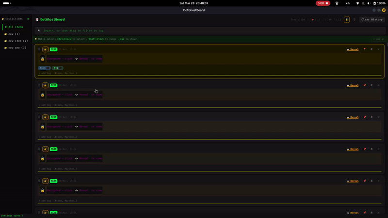
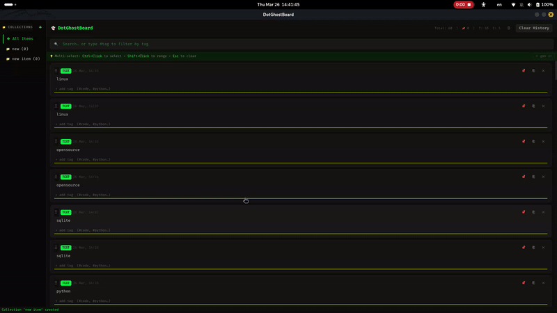
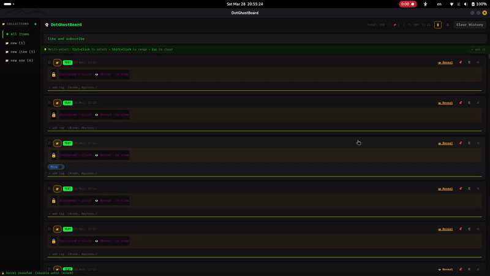
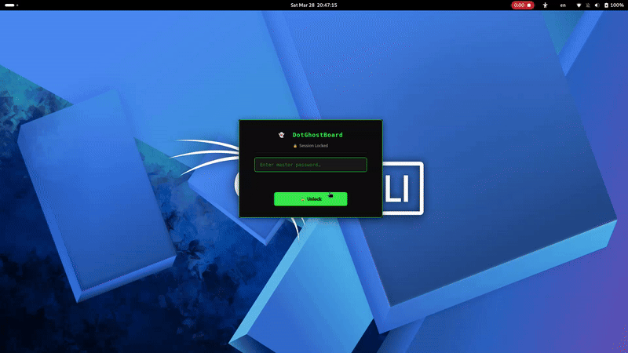
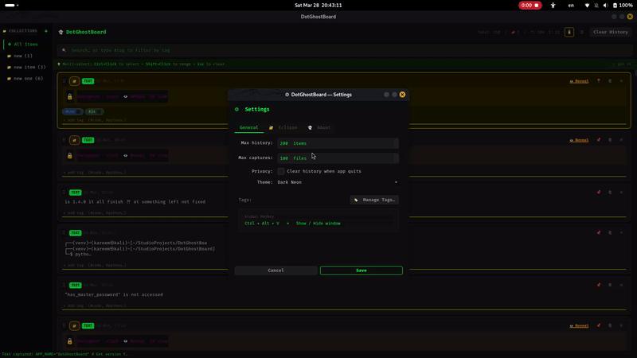
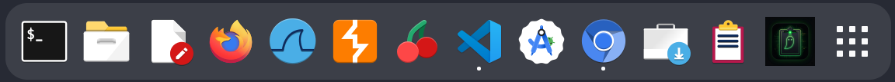
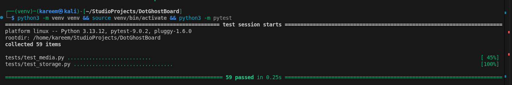

# 👻 DotGhostBoard

> Advanced clipboard manager for Kali Linux — part of the [**DotSuite**](https://www.dotsuite.dev/en) toolkit.

[](https://www.dotsuite.dev/en)


---

## What is DotGhostBoard?

DotGhostBoard is a lightweight, privacy-first clipboard manager built natively for Linux. It runs silently in the background, capturing everything you copy — text, images, and video paths — and stores them locally in a SQLite database. No cloud. No telemetry. No Electron.

Think **Ditto** (Windows) or **CopyQ** (Linux) — but built for the DotSuite ecosystem with a Kali-native dark aesthetic.





---

## Features

- **Text capture** — Every text you copy is saved instantly
- **Image capture** — Screenshots and copied images saved as `.png`
- **Video path detection** — Detects copied file paths for `.mp4`, `.mkv`, `.avi`, and more
- **Pin system** — Pin important items; they are protected from deletion forever
- **Persistent storage** — SQLite database survives reboots
- **Real-time search** — Filter your clipboard history instantly
- **Clear history** — Wipe unpinned items in one click (pinned items always stay)
- **System tray** — Lives quietly in your tray, always available
- **Global Shortcuts** — `Ctrl+Alt+V` toggles the dashboard from anywhere; `Ctrl+Alt+Space` opens the floating Spotlight search overlay (GNOME & XFCE native)
- **Tiling Window Manager Support (EWMH)** — Seamless cross-workspace migration upon summon (`Ctrl+Alt+V`, `dotghostboard --toggle`) on Qtile, Openbox, and EWMH-compliant window managers; migrates to your active workspace and focuses without hiding
- **Spotlight Quick Search** — Floating, instant clipboard search overlay (`Ctrl+Alt+Space`); search, navigate with arrows, copy, and close instantly with zero window flicker; protected by Eclipse Master Password
- **In-Dashboard Search** — `Ctrl+F` instantly focuses and selects the search bar within the main dashboard
- **App icon** — Auto-generated neon ghost icon via `scripts/generate_icon.py`
- **Dark Neon UI** — Custom QSS theme built for dark desktops
- **Settings panel** — ⚙ Max history limit, privacy clear-on-exit, theme toggle
- **Desktop notifications** — Settings → Notifications → Enable desktop notifications → Save.
  Changes apply immediately; security alerts, update alerts, and notification sounds can be
  controlled separately. Disabling desktop notifications keeps secret protection active.
- **Vault-aware clipboard protection** — Passwords already stored in the Vault stay out of
  clipboard history and sync, even with heuristic password detection disabled. Open a
  non-empty Vault once after starting the app to enable verification; until then, text is
  withheld from history. Protection continues after the Vault auto-locks.
- **Keyboard navigation** — `↑`/`↓` to move between cards, `Enter` to copy, `Esc` to clear focus
- **Double-click to paste** — Double-click any card to copy it instantly
- **Standalone autostart** — `scripts/setup_autostart.py` sets up boot entry without bash
- **Image thumbnail previews** — Lazy-loaded thumbnails capped at 300×180px; deferred rendering via `QTimer.singleShot`
- **Video thumbnails via ffmpeg** — First-frame extraction from video files; background thread processing; graceful fallback if ffmpeg unavailable
- **Auto-cleanup** — Configurable `max_captures` limit (default 100); oldest unpinned captures deleted from disk on startup
- **Image viewer popup** — Full-size image preview with smooth scaling; `Ctrl+C` to copy image; `Escape` to close
- **Copy image to clipboard** — Image items now copy actual image data (not file path) back to clipboard
- **Drag & drop reorder** — Pinned cards show drag handle; reorder persists via `sort_order` in database
- **Tag system** — Assign custom `#tags` to any item; colored chip display with rotating 6-palette colors; inline autocomplete from existing tags



- **Combined search** — Search by text and tag simultaneously (e.g. `"python #code"`); tag-only filter works on all item types
- **Collections & Drag-and-Drop** — Group items into named folders; sidebar panel with click-to-filter, right-click to rename/delete. Features intuitive drag-and-drop interface for organizing items.



- **Multi-select** — `Ctrl+Click` to toggle, `Shift+Click` for range selection; neon green `✓` overlay on selected cards



- **Local Encryption (Eclipse Mode)** — Secure sensitive clipboard items using AES-256 encryption. Items are hidden and locked behind a Secret Overlay until explicitly revealed.



- **Session Lock & Master Password** — Protect your entire dashboard with a Master Password. Features automatic timeout locking and a stylish blurred lock screen.



- **Advanced Settings & Pro UI** — Comprehensive control over Stealth Mode, App Filters, Auto-lock timeouts, and a beautiful DotSuite licensing/about page.



- **Bulk actions toolbar** — Appears when 2+ selected: Pin All, Unpin All, Add Tag, Export, Delete All, Cancel
- **Export** — Export selected items to `.txt` (timestamped blocks) or `.json` (structured data with tags)
- **Global tag manager** — ⚙ Settings → "Manage Tags…"; rename or delete tags across all items in one click
- **Drag & drop visual feedback** — Ghost pixmap with neon border while dragging; source card dims to 35%; drop targets highlight with dashed green border

- **E2EE Local Network Sync (Nexus)** — End-to-end encrypted clipboard synchronization across your local network. AES-256-GCM protection with X25519 (ECDH) handshakes.
- **mDNS Auto-Discovery** — Zero-config discovery of peers on the same WiFi.
- **REST API** — Token-protected local-network API for history, item pushing, and pairing workflows.
- **CLI Companion** — `dotghost push` and `dotghost pop` from your terminal for seamless shell workflow.
- **Secure Device Pairing** — PIN-protected handshakes to ensure unauthorized devices can't intercept your sync data.
- **The Vault Subsystem (`Ctrl+Shift+V`)** — Dedicated encrypted drawer panel (`vault.db`) with envelope encryption (domain-separated KEK + per-database DEK), masked secrets, search filtering, category pills, constant-time deduplication, and auto-scrubbing. Features an expanded 380px drawer with a clean two-row header and an informative Empty State Tips Card.
- **Zero-Log Secret Detector** — Shannon entropy analysis & regex heuristics detecting API keys, tokens, and passwords on copy, offering one-click "Send to Vault" and auto-scrub actions without leaving plaintext in history.
- **Desktop Notifications** — Native FreeDesktop desktop notifications (`notify-send`) with interactive click-to-summon callbacks.
- **Copy Count Badge** — Each card shows a live pill badge (`×2`, `×5`, `×10+`) tracking how many times an item has been copied. Color escalates from teal → orange → 🔥 as the count grows.
- **Auto-Pin Suggestion** — At `×5` copies a non-blocking toast appears suggesting you pin the item. At `×10` the item is **auto-pinned silently** so frequently-used text is always protected from deletion.
- **Smart Auto-Tagging (Leviathan)** — Zero-overhead rules engine automatically categorizes incoming clips (`#link`, `#code`, `#json`, `#secret`, `#email`, `#ip`, `#phone`, `#path`, `#hash`) using local regex heuristics.
- **Contextual Smart Actions** — Inline card actions tailored to content type: `🔗 Open Link` in browser, `{ } Format JSON` with indentation, `✉ Compose` email, `📡 Copy IP`, or `🛡 → Vault` to securely encrypt credentials.
- **Built-in Vault Password & Token Generator** — Cryptographically strong password/token generator in Add/Edit Secret dialog (`⚡ Generate`) with customizable length, symbols, and live Shannon entropy strength bar.
- **Vault Password History** — Retains last 3 previous encrypted password versions (`vault_item_history`) with single-click reveal, copy, or revert via dedicated `📜` history modal dialog.
- **Vault Encrypted Export & Import (`.vault`)** — Standalone AES-256-GCM encrypted backup packages protected by high-iteration PBKDF2-HMAC-SHA256 (100,000 rounds); exports all secrets, 3-version history, and expiry dates with zero disk plaintext leaks and intelligent duplicate resolution.
- **Secret Expiration Dates & Status Badges** — Optional expiration dates on vault items (`30d`, `90d`, `180d`, `1y`, or custom date picker) with live visual card status badges (`⛔ EXPIRED`, `⚠️ Xd left`, `⏳ YYYY-MM-DD`).
- **Vault Plaintext History Sweep** — Deleting or scrubbing a secret from The Vault automatically purges any lingering unencrypted plaintext copies from clipboard history.
- **Dynamic Auto-Purge History** — Configurable history threshold dynamically enforced from Settings, auto-purging oldest unpinned items while respecting pin immunity.
- **Unified Password Input & Masking (`PasswordInputWidget`)** — Reusable password input with integrated `👁️ / 🙈` eye toggle, unified design system, and compact, balanced spacing across both App Session Lock and Vault Unlock screens.
- **Modern Typography & Aesthetic** — Clean sans-serif UI typography (`Inter` / `Noto Sans`), muted dark-slate theme, refined card padding, compact 26×26 action buttons, and customizable shortcuts button in Settings.
- **Mouse Selection Monitoring (PRIMARY Selection)** — Optional automatic capture of text highlighted with the mouse (X11 `PRIMARY` selection, Issue #2) with 450ms anti-flood debouncing and smart 3-way consolidation (forward append, backward prepend, recoil boundary trimming).
- **Dynamic Primary-to-Clipboard Sync** — Automatically synchronizes mouse-highlighted text to the system `CLIPBOARD` buffer (`Ctrl+V`) without echo loops, so selecting text with mouse immediately enables pasting via `Ctrl+V` across any application.
- **Card Middle-Click to PRIMARY** — Middle-clicking any item card (`Qt.MouseButton.MiddleButton`) instantly copies its contents into the Linux `PRIMARY` selection buffer for native X11 middle-click pasting.
- **Mouse Clip Badge (`🖱️ mouse`)** — Distinct emerald pill badge rendered on cards captured via mouse drag to easily differentiate from manual `Ctrl+C` keyboard copies.
- **Subtle Audio Feedback** — Configurable non-blocking sound feedback on clipboard capture with 4 built-in synthesized presets (`Ghost Pop`, `Crystal Chime`, `Tactile Click`, `Cyber Beam`) and custom audio file chooser (`.wav`, `.mp3`, `.ogg`, `.flac`).
- **Vault Multi-Format CSV Importer** — Dedicated wizard for The Vault supporting Bitwarden, KeePassXC, 1Password, Google Chrome, and generic CSV credential exports with preview table and duplicate protection.

**Native Desktop Integration:**
DotGhostBoard integrates seamlessly with desktop environment dock and app launcher.



---

## Project Structure

```
DotGhostBoard/
├── main.py                          # Entry point + IPC local server (--toggle, --spotlight)
├── core/
│   ├── constants.py                 # App-wide constants (PAGE_SIZE, thresholds)
│   ├── config.py                    # Runtime configuration helpers
│   ├── paths.py                     # XDG path resolution
│   ├── crypto.py                    # AES-256-GCM + HKDF domain-separated key derivation
│   ├── notifications.py             # FreeDesktop notification dispatcher (action callbacks)
│   ├── window_manager.py            # Pure ctypes EWMH X11 window management
│   ├── watcher.py                   # Clipboard Orchestrator → Backend + Pipeline
│   ├── shortcuts.py                 # Global desktop shortcut manager (GNOME/XFCE)
│   ├── autostart.py                 # Modular XDG autostart desktop entry manager
│   ├── sync_engine.py               # E2EE background push worker (Nexus)
│   ├── network_discovery.py         # Zeroconf mDNS peer discovery (Nexus)
│   ├── api_server.py                # Local REST API & Handshake handler (Nexus)
│   ├── pairing.py                   # PIN-based ECDH handshake logic (Nexus)
│   ├── updater.py                   # GitHub auto-updater engine
│   ├── app_filter.py                # App whitelist/blacklist (Eclipse)
│   ├── media.py                     # Image/video handler
│   ├── audio.py                     # Non-blocking audio dispatcher (pw-play, paplay, aplay, mpv)
│   ├── clipboard/                   # Clipboard pipeline & backend abstraction
│   │   ├── events.py                # ClipboardEvent, CaptureDecision, Action enum
│   │   ├── pipeline.py              # Pure policy engine (no Qt dependency)
│   │   ├── backend.py               # ClipboardBackend Protocol
│   │   └── backends/qt_backend.py   # Qt polling backend
│   ├── security/                    # Security domain layer
│   │   ├── detector.py              # SecretDetector (regex & entropy heuristics)
│   │   ├── auto_tagger.py           # Rules-based auto-tagging engine (Leviathan)
│   │   └── vault/                   # Vault: isolated vault.db + DEK envelope encryption
│   ├── services/                    # Business logic layer (Qt-free)
│   │   ├── history_service.py       # Clipboard item queries, pins, tags, copy thresholds
│   │   ├── collection_service.py    # Collection management & categorization
│   │   ├── security_service.py      # Session lock, password lifecycle, Eclipse encryption
│   │   └── sync_service.py          # Peer trust & LAN sync orchestration
│   └── storage/                     # Persistence layer
│       ├── database.py              # Context-managed SQLite connection
│       ├── migrations.py            # Versioned schema migrations
│       ├── __init__.py              # Backward-compatible facade
│       └── repositories/
│           ├── clips.py             # Clipboard item CRUD, encryption, search
│           ├── tags.py              # Tag normalization & global rename/delete
│           ├── collections.py       # Collection categorization
│           ├── peers.py             # Trusted device credentials
│           └── stats.py             # Header metrics & copy counts
├── ui/
│   ├── dashboard.py                 # Window shell + signal bus (Orchestrator ≤ 500 LOC)
│   ├── dashboard_compat.py          # DashboardCompatibilityMixin architectural shim
│   ├── window_utils.py              # EWMH cross-workspace migration & dialog modality
│   ├── components/                  # Isolated UI layout components
│   │   ├── __init__.py              # Component exports
│   │   ├── sidebar.py               # SidebarWidget (collections & devices layout)
│   │   ├── topbar.py                # TopBarWidget (header, logo, stats, action buttons)
│   │   ├── cards_view.py            # CardsView (QScrollArea container & DnD signals)
│   │   ├── bulk_toolbar.py          # BulkToolbar (HintStrip & BulkBar)
│   │   └── tray_manager.py          # DashboardTrayManager (tray icon, context menu, tooltips)
│   ├── controllers/                 # Behavioral QObject controllers
│   │   ├── history_controller.py    # Card lifecycle, pagination, search, pin/copy/delete
│   │   ├── collection_controller.py # Sidebar, drag-drop, collection CRUD
│   │   ├── security_controller.py   # Lock/unlock, secret copy, Eclipse encrypt/decrypt
│   │   ├── sync_controller.py       # Peer pairing, device list, broadcast
│   │   └── update_controller.py     # Update check worker and notification trigger
│   ├── vault/                       # The Vault UI subsystem
│   │   ├── vault_panel.py           # Slide-out Vault drawer widget (two-row header & tips card)
│   │   ├── vault_controller.py      # Vault lifecycle & duplicate detector
│   │   ├── secret_card.py           # Masked secret card with reveal/copy/scrub
│   │   ├── secret_dialog.py         # Add/Edit secret modal
│   │   ├── history_dialog.py        # Password history viewer & version revert modal
│   │   ├── backup_dialog.py         # Passphrase modal for encrypted export & import (.vault)
│   │   ├── csv_import_dialog.py     # CSV credential import wizard modal (Bitwarden, KeePassXC)
│   │   ├── unlock_dialog.py         # Vault master password unlock dialog
│   │   └── send_to_vault.py         # Bridge from clipboard cards to Vault
│   ├── widgets/                     # Modular widget package
│   │   ├── item_card.py             # Full clipboard card widget
│   │   ├── stats_header.py          # Header stats bar
│   │   ├── pin_toast.py             # Non-blocking pin suggestion toast
│   │   ├── tag_chip.py              # Tag chip widget
│   │   ├── tag_input.py             # Inline tag autocomplete input
│   │   └── password_input.py        # Composite PasswordInputWidget with eye visibility toggle
│   ├── spotlight.py                 # Floating Spotlight quick search overlay
│   ├── settings/                    # Settings package (decomposed)
│   │   ├── __init__.py              # Backward-compatible facade
│   │   ├── _io.py                   # Settings I/O and defaults
│   │   ├── dialog.py                # SettingsDialog orchestrator shell
│   │   └── pages/                   # Tab builders (General, Security, API, About)
│   ├── tag_manager.py               # Standalone TagManagerDialog
│   ├── lock_screen.py               # Session lock screen
│   ├── pairing_dialog.py            # Device pairing UI (Nexus)
│   ├── updater_dialog.py            # GUI for GitHub updates
│   ├── update_log_screen.py         # Update installation log & process relauncher
│   └── ghost.qss                    # Dark Neon theme stylesheet
├── cli/
│   └── dotghost.py              # Command-line companion (push, pop, spotlight, toggle)
├── data/
│   ├── icons/                   # Generated app icons + ghost.svg source
│   ├── captures/                # Sample captures (.png)
│   ├── assets/                  # GIFs, screenshots, demo media
│   └── settings.json            # Bundled default settings template
├── scripts/
│   ├── generate_icon.py         # Draws ghost icon at 16/32/48/64/128/256px
│   ├── generate_sounds.py       # Wave audio synthesizer generating custom UI feedback presets
│   ├── install.sh               # Autostart + shortcut + CLI symlinker
│   ├── setup_shortcuts.py       # Desktop shortcut configurator (GNOME/XFCE)
│   ├── build_appimage.sh        # AppImage builder
│   └── setup_autostart.py       # Standalone Python autostart installer
├── tests/
│   ├── test_primary_selection.py# Primary selection, mouse ergonomics & audio tests
│   ├── test_api.py              # REST API & Sync tests
│   ├── test_autostart.py        # Autostart manager tests
│   ├── test_eclipse.py          # Encryption & Security tests
│   ├── test_ipc_spotlight.py    # IPC, Spotlight & Shortcuts tests (220 total passed)
│   ├── test_media.py            # Media detection tests
│   ├── test_runtime_dir.py      # Runtime directory tests
│   └── test_storage.py          # Database CRUD tests
├── roadmap(v1.x).md
├── CHANGELOG.md
├── requirements.txt
├── pytest.ini
└── .gitignore
```

---

## Requirements

| Dependency | Version  |
|------------|----------|
| Python     | 3.11+    |
| PyQt6      | 6.6.0+   |
| Pillow     | 10.0.0+  |
| cryptography | 41.0.0+ |
| pytest     | 7.0.0+   |

---

## 📥 Download

- 🐧 **[AppImage](https://github.com/kareem2099/DotGhostBoard/releases/latest)** — Portable Linux build
- 📦 **[DEB](https://github.com/kareem2099/DotGhostBoard/releases/latest)** — Debian / Ubuntu / Kali
- 📦 **[Arch package](https://github.com/kareem2099/DotGhostBoard/releases/latest)** — `.pkg.tar.zst`
- 🗜️ **[Portable tarball](https://github.com/kareem2099/DotGhostBoard/releases/latest)** — Extract & run anywhere

---

## Installation

### Option A — System Python (Kali Linux)

PyQt6 and Pillow are usually pre-installed on Kali:

```bash
git clone https://github.com/kareem2099/DotGhostBoard.git
cd DotGhostBoard
python3 main.py
```

### Option B — Virtual Environment (Recommended)

```bash
git clone https://github.com/kareem2099/DotGhostBoard.git
cd DotGhostBoard

# Create isolated environment
python3 -m venv venv --system-site-packages
source venv/bin/activate

# Install dependencies
pip install -r requirements.txt

# Generate app icon (run once)
python3 scripts/generate_icon.py

# Run
python3 main.py
```

### Option C — pip install (PyPI)

> **Note:** PyPI package publication is planned; use DEB, AppImage, or Git clone for v2.1.2.

```bash
# Planned for PyPI release
pip install dotghostboard
dotghostboard
```

### Option D — AppImage (Portable)

Download the `.AppImage` from [Releases](https://github.com/kareem2099/DotGhostBoard/releases), then:

```bash
chmod +x DotGhostBoard-*.AppImage
./DotGhostBoard-*.AppImage
```

No installation required. Runs on compatible 64-bit Linux distributions.

### Option E — Full install (autostart + shortcut + icon)

```bash
chmod +x scripts/install.sh
./scripts/install.sh
```

This configures autostart, the desktop launcher, CLI companion, and global shortcuts on supported GNOME/XFCE desktops:

- `Ctrl+Alt+V` — Toggle Dashboard
- `Ctrl+Alt+Space` — Spotlight Quick Search

### Option F — Build AppImage from source

```bash
pip install pyinstaller
chmod +x scripts/build_appimage.sh
./scripts/build_appimage.sh
```

### Option G — DEB Package (Debian/Ubuntu/Kali)

**Quick install from Releases:**

```bash
# Download the latest .deb from GitHub Releases
wget https://github.com/kareem2099/DotGhostBoard/releases/latest/download/dotghostboard_2.1.2_amd64.deb

# Install via apt
sudo apt install ./dotghostboard_2.1.2_amd64.deb

# Run
dotghostboard
```

**Or build locally:**

```bash
# Clone and build
git clone https://github.com/kareem2099/DotGhostBoard.git
cd DotGhostBoard

# Build the .deb package
chmod +x scripts/build_deb.sh
./scripts/build_deb.sh

# Install
sudo dpkg -i dotghostboard_*.deb

# Run
dotghostboard
```

**Uninstall:**

```bash
sudo apt remove dotghostboard
```

**Installed locations:**
- Binary: `/opt/dotghostboard/`
- Launcher: `/usr/bin/dotghostboard`
- Desktop entry: `/usr/share/applications/dotghostboard.desktop`
- Icon: `/usr/share/icons/hicolor/256x256/apps/dotghostboard.png`

---

## Usage

| Action | How |
|--------|-----|
| Copy anything | Just use `Ctrl+C` anywhere — DotGhostBoard captures it automatically |
| Mouse Selection (PRIMARY) | Highlight text with mouse — captured automatically when enabled in Settings |
| Middle-Click to PRIMARY | Middle-click any card to copy directly to Linux PRIMARY buffer for middle-click paste |
| Toggle window | Press `Ctrl+Alt+V` from anywhere to show or hide the dashboard |
| Spotlight search | Press `Ctrl+Alt+Space` from anywhere for instant floating quick search |
| Focus search | Press `Ctrl+F` inside the dashboard to search history |
| Pin an item | Click 📌 on any card |
| Unpin an item | Click 📍 on a pinned card |
| Copy back | Click ⎘ on any card — or **double-click** the card |
| Delete an item | Click ✕ — pinned items are protected |
| Keyboard navigation | Press `↑` / `↓` to move focus; `Enter` or `Space` to copy; `Esc` to clear |
| Clear history | Click "Clear History" — pinned items are never deleted |
| Settings | Click ⚙ in the top bar — adjust history limit, global shortcuts, privacy |
| Minimize | Click X — the app stays alive in the system tray |
| Quit | Right-click the tray icon → Quit |

### 🛡️ The Vault & Encrypted Backups (`.vault`)

The Vault (`Ctrl+Shift+V`) is a physically isolated, encrypted credential storage engine (`vault.db`).

* **Envelope Encryption**: Secrets are encrypted with a per-database Data Encryption Key (DEK), wrapped with a domain-separated Key Encryption Key (KEK) derived from your Master Password via HKDF-SHA256.
* **Streamlined Two-Row Drawer**: Slide-out drawer with dedicated title/badge status row and independent action toolbar (`+ Add Secret`, Lock/Unlock, Export, Import, Tips).
* **Empty State Onboarding**: Informative tips card explaining quick shortcuts (`Ctrl+Shift+V`), 30-second clipboard scrubbing, 3-version history, and expiration monitoring.
* **Encrypted Export (`.vault`)**: Clicking `📤 Export` packages all secrets, 3-version password histories, categories, timestamps, and expiration dates into a standalone binary file.
  - **Cipher**: `AES-256-GCM` (authenticated encryption with 96-bit random nonce and 128-bit authentication tag).
  - **Key Derivation**: `PBKDF2-HMAC-SHA256` with **100,000 rounds** and an independent, per-backup 16-byte random salt.
  - **Zero Plaintext**: Absolutely zero unencrypted text is written to disk. The resulting `.vault` package is safe to store in the cloud, on USB drives, or transfer across systems.
  - **Passphrase Security**: Protected by an independent passphrase chosen at export. Passphrases are never stored; backups cannot be decrypted if the passphrase is forgotten.
* **Authenticated Import**: Clicking `📥 Import` prompts for the backup passphrase, verifies the package's cryptographic integrity tag, and imports secrets into your Vault while automatically skipping exact duplicates.

### Window Manager & Multi-Workspace Compatibility

DotGhostBoard automatically adheres to the **Extended Window Manager Hints (EWMH)** specification under X11. When invoked via global shortcut (`Ctrl+Alt+V`) or Spotlight (`Ctrl+Alt+Space`) on another virtual desktop or workspace, the window and modal dialogs seamlessly migrate to your active workspace (verified against **Qtile** and **Openbox**; should work on any EWMH-compliant tiling WM such as i3 or bspwm, but not yet independently tested on those).

#### Environment Variables

| Variable | Default | Description |
|---|---|---|
| `DOTGHOST_HOME` | `~/.config/dotghostboard` | Override the custom configuration and database directory. |
| `DOTGHOST_NO_EWMH` | `0` | Set to `1` to disable EWMH workspace migration and leave window placement strictly to your window manager's default placement rules. |

---

## Running Tests

```bash
QT_QPA_PLATFORM=offscreen DOTGHOST_FORCE_WAYLAND=1 python3 -m pytest
```

Latest verification (headless Qt):
```text
589 passed
```



---

## Roadmap

| Version | Codename | Status | Goal |
|---------|----------|--------|------|
| v1.0.0 | Ghost | ✅ Released | Stable base — clipboard, pin system, dark UI, SQLite |
| v1.1.0 | Phantom | ✅ Released | Settings panel, keyboard nav, double-click paste, SVG icon |
| v1.2.0 | Specter | ✅ Released | Image thumbnails, video preview via ffmpeg, auto-cleanup, image viewer |
| v1.3.0 | Wraith | ✅ Released | Tags, collections, multi-select, bulk actions, export |
| v1.4.0 | Eclipse | ✅ Released | AES-256 encryption, master lock, stealth mode, pro UI |
| v1.4.1 | Mem & Perf | ✅ Released | Memory optimizations, GitHub auto-updater, IPC/Wayland bug fixes |
| v1.5.0 | Nexus | ✅ Released | E2EE Network Sync, mDNS Discovery, REST API, CLI Companion |
| v1.5.1 | Nexus Hotfix I | ✅ Released | Update pipeline security, self-cleanup install script |
| v1.5.2 | Nexus Hotfix II | ✅ Released | Aura Check easter egg, Pigeon Doctor purge screen, migration fix |
| v1.5.3 | Nexus Hotfix III | ✅ Released | Fix blank/white window in deb & AppImage (PyInstaller resource path) |
| v1.5.4 | Nexus Hotfix IV | ✅ Released | Clipboard capture reliability fix (3-layer bug); Copy Count Badge; Auto-Pin Suggestion |
| v1.5.5 | Nexus Polish & Spotlight | ✅ Released | Spotlight quick search overlay, relative time, copy count reset, image deduplication, search debounce |
| v1.5.6 | Nexus Global Hotkeys & UI Polish | ✅ Released | Per-user Global Desktop Shortcuts (GNOME/XFCE), decoupled Spotlight, Eclipse lock protection, UI theme polish, 220 tests |
| v1.5.7 | Nexus Hotfix V | ✅ Released | CI headless stability, packaging Python dependencies, CLI enhancements, 220 tests |
| v1.6.0 | Phantom | ✅ Released | v2.x Architecture Foundation: Controllers, Services, Repositories, Pipeline (306 tests) |
| v2.0.0 | Cerberus | ✅ Released | The Vault UI, Zero-Log Secret Detector, FreeDesktop Notifications, 2.0.0 Icon Architecture (470 tests) |
| v2.0.1 | Cerberus | ✅ Released | Tiling Window Manager EWMH Migration (Qtile/Openbox), Workspace Toggle Fix, Vault & Notification Hardening (489 tests) |
| v2.1.0 | Leviathan | ✅ Released | Smart Auto-Tagging, Contextual Card Actions, Vault Generator, Password History, Vault Export/Import, Secret Expiry, Vault Sweep, Auto-Purge (522 tests) |
| v2.1.2 | Leviathan | Prepared locally | Vault clipboard protection, configurable notifications, PRIMARY fixes, runtime-only packaging (589 tests) |
| v2.1.1 | Leviathan | ✅ Released | Primary Selection (Issue #2), Mouse Ergonomics & Badges, Middle-Click to PRIMARY, UI Audio Feedback & Sound Synthesizer, Vault CSV Importer (546 tests) |

Full details in [`roadmap(v2.x).md`](roadmap(v2.x).md)

---

## Acknowledgments

Special thanks to **[@knodalyte](https://github.com/knodalyte)** for reporting GitHub Issue [#1](https://github.com/kareem2099/DotGhostBoard/issues/1) ("[BUG] does not behave well under tiling window manager") and GitHub Issue [#2](https://github.com/kareem2099/DotGhostBoard/issues/2) ("[FEATURE] config option to support primary selection"), driving key power-user capabilities across window managers and mouse workflows.

---

## Contributing

Contributions are welcome. Please read [`CONTRIBUTING.md`](CONTRIBUTING.md) before submitting a pull request.

---

## License

Apache 2.0 — see [`LICENSE`](LICENSE) for details.

---

## Part of DotSuite

DotGhostBoard is one tool in the **[DotSuite](https://www.dotsuite.dev/en)** collection — a suite of modern, lightweight, and privacy-focused productivity tools built for Linux power users.

🌐 **Ecosystem Website:** [https://www.dotsuite.dev/en](https://www.dotsuite.dev/en)

> DotEnv · DotCommand · DotSense · DotFetch · DotShare · DotScramble · **DotGhostBoard**

---

*Built with 💀 on Kali Linux*
